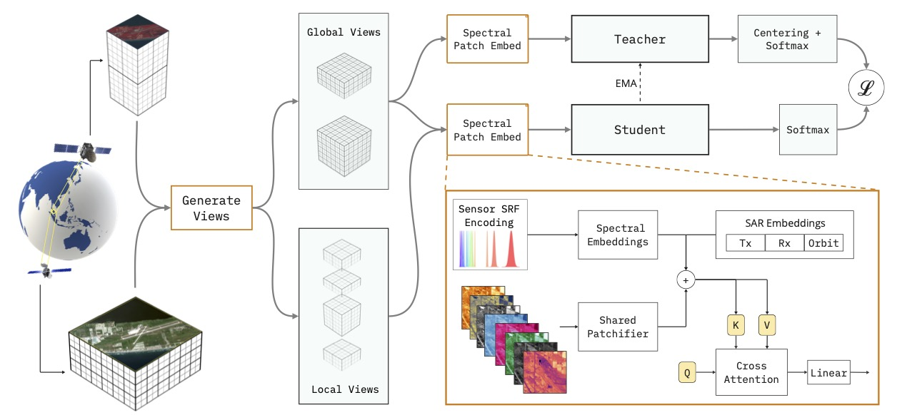

# Panopticon
[](https://opensource.org/licenses/Apache-2.0)


This repository contains the official implementation of the paper [Panopticon: Advancing Any-Sensor Foundation Models for Earth Observation](https://www.arxiv.org/abs/2503.10845). The code is heavily based on the [official DINOv2 codebase](https://github.com/facebookresearch/dinov2), with the main novelties being the patch embedding in `dinov2/models/panopticon.py` and the augmentations in `dinov2/data/augmentations.py`.


Panopticon Architecture Overview. Orange frame shows deviations from standard DINOv2.

<!-- Big parts of `dinov2/eval/wrapper.py` and all code in `dinov2/eval/models/*` is 
taken from https://github.com/zhu-xlab/DOFA (which is itself mainly taken from the original repos). -->

## Updates
- Panopticon has selected as the **best paper** at the [EarthVision workshop at CVPR 2025](https://www.grss-ieee.org/events/earthvision-2025/) 🥳 ! We'll be in Nashville, TN in June - drop by and say hello!
- Panopticon will be presented at the European Space Agency's [Living Planet Symposium 2025](https://lps25.esa.int/), held in Vienna in June 2025 ⛰️
- We will also be at [IGARRS 2025](https://2025.ieeeigarss.org/index.php) - this year in Brisbane 🦘!
- Panopticon has been added as a model to [TorchGeo 0.7](https://torchgeo.readthedocs.io/en/stable/api/models.html#panopticon) - makes its super easy to use with the existing RS datasets

## Using Panopticon
To use Panopticon, just install torch and follow this example:
```python
import torch

# load model
model = torch.hub.load('Panopticon-FM/panopticon','panopticon_vitb14')

# generate example input
x_dict = dict(
  imgs = torch.randn(2, 3, 224, 224),  # (B, C, H, W)
  chn_ids = torch.tensor([[664, 559, 493]]).repeat(2,1)  # (B, C), RGB wavelengths in nm
)

# get image-level features (for classification, regression, ...)
normed_cls_token = model(x_dict)
assert tuple(normed_cls_token.shape) == (2, 768)

# get patch-level features (for segmentation)
blk_indices = [3, 5, 7, 11]
blocks = model.get_intermediate_layers(x_dict, n=blk_indices, return_class_token=True)
assert len(blocks) == 4
cls_tokens = [blk[1] for blk in blocks]
patch_tokens = [blk[0] for blk in blocks]
assert tuple(cls_tokens[0].shape) == (2, 768)
assert tuple(patch_tokens[0].shape) == (2, (224/14)**2, 768)
```
For best results, please follow the pre-training settings of Panopticon: 224x224 images with standard normal normalization. The code automatically downloads the teacher weights, access to the full weights and the weights of the dino heads from RGB pre-training (as described in the paper) [here](https://huggingface.co/lewaldm/panopticon).

## Installation
Setup the conda environment with
```
conda create -n panopticon python=3.9 --yes
conda activate panopticon
pip install -r requirements.txt
```

The following env variables need to be put in `.env` file in the codebase root
```
WANDB_PROJECT=your_wandb_proj_name
GEO_BENCH_DIR=/path/to/geobench/dir
RDIR=/path/to/resource/dir
CDIR=/.../panopticon/dinov2/configs
ODIR=/path/to/output/dir
```
Datsets are saved in `$RDIR/datasets/`.

## Training Datasets
### FMoW

We use a combined fmow-fmow_sentinel dataset. To use this dataset, follows these steps:
1. Download the `fmow` dataset from [the official github repo](https://github.com/fMoW/dataset?tab=readme-ov-file). You only need `fmow-full` NOT `fmow-rgb`. Unzip to a your `dataset` folder. tl;dr `aws s3 ls s3://spacenet-dataset/Hosted-Datasets/fmow/fmow-full/`. Caution: this is a LARGE dataset ~3.5TB, and will take some time to untar!

2. Download the `fmow-sentinel` dataset from [this link](https://purl.stanford.edu/vg497cb6002). Unzip to your `dataset` folder. Large-ish dataset ~80GB

3. Setup a folder called `metadata_v2` under `fmow/` and download the metadata files from [this link](https://drive.google.com/drive/folders/1nsTN-5v6jHusYm_NnKrVLN-TYo7RmUz8?usp=drive_link)


### MMEarth

1. Download the `mmearth` dataset from the [links on the official github repo](https://github.com/vishalned/MMEarth-data). Please download atleast the MMEarth (full dataset). Unzip to your `dataset` folder. Large-ish dataset ~600GB

2. Download the metadata parquet file [from this link](https://drive.google.com/drive/folders/1LfTBRxJNzgDFIrW1yD9gPbV2Rl-ZV3-d?usp=drive_link) and place in the `mmearth/data_1M_v001` folder.

### SatlasPretrain
<!-- While SatlasPretrain is about 12 TB, we actually only use about 1 TB of it.  -->
Please follow the instructions on the original [Satlas-Pretrain repo](https://github.com/allenai/satlas/blob/main/SatlasPretrain.md) to download the following datasets:
- Sentinel-2
- Sentinel-1
- Landsat 8/9
We did not use NAIP for training since it is neither spectrally not geographically diverse, covering only RGB-NIR bands over the contiguous United States. However, it has imagery at 1m GSD, so you may consider it for your purposes.

### SpectralEarth
Please download this dataset directly from the [DLR website](https://geoservice.dlr.de/web/datasets/enmap_spectralearth) by signing up and requesting it. We believe that the authors are expected to release this without requiring to sign up soon. Please contact the authors of [SpectralEarth](https://arxiv.org/abs/2408.08447) for this information directly.

### Metadata Files

In addition, to use these datasets as paired-sensor inputs, as required by this pretraining paradigm, you will need metadata files that are indexed by footprint. Please download the metadata files directly from [this link](https://huggingface.co/lewaldm/panopticon) and place each `metadata_v2` folder under the respective dataset directories for `fmow`, `fmow-sentinel` and `satlas` only (`mmearth` and `spectral_earth` come pre-indexed by footprint). Your directory structure should be similar to the one below after acquiring all these datasets:


```
datasets
├── fmow
│   ├── metadata_v2
│   ├── seq
│   ├── seq_gt
│   ├── seq_gt_mapping.json
│   ├── test
│   ├── test_gt
│   ├── test_gt_mapping.json
│   ├── train
│   └── val
├── fmow-sentinel
│   ├── metadata_v2
│   ├── test_gt
│   ├── train
│   └── val
├── mmearth
│   ├── data_100k_v001
│   └── data_1M_v001
├── satlas
│   ├── landsat
│   ├── metadata_v2
│   ├── sentinel1
│   └── sentinel2
└── spectral_earth
    ├── cdl
    ├── corine
    ├── enmap
    ├── nlcd
    └── splits
        ├── cdl
        │   ├── test.txt
        │   ├── train.txt
        │   └── val.txt
        ├── corine
        │   ├── test.txt
        │   ├── train.txt
        │   └── val.txt
        ├── enmap
        │   └── train.txt
        └── nlcd
            ├── test.txt
            ├── train.txt
            └── val.txt
```
Note: we are only showing the relevant files & directories above.


## Evaluation Datasets

This codebase is limited in its ability to run comparitive benchmarking. We will soon release a separate codebase to do this rigorously. For now, to run eval on a limited set of dataset, use the following:

### GeoBench
Follow the [official instructions](https://github.com/ServiceNow/geo-bench?tab=readme-ov-file#downloading-the-data) from GeoBench.

### RESISC45
coming soon

### BigEarthNet-v2
coming soon

## Training
Load the environment variables and from the root directory of the code, do for single gpu
```
PYTHONPATH=. python dinov2/train/train.py \
  --config-file=dinov2/configs/quick_check.yaml \
  --output_dir=.
```
and for multi-gpu
```
PYTHONPATH=. torchrun --nproc_per_node=2 dinov2/train/train.py \
  --config-file=dinov2/configs/quick_check.yaml \
  --output_dir=.
```
For an overview of default arguments, see `dinov2/configs/pretrain_default.yaml`.


## Evaluation
This section only refers to the evaluation of Panopticon (c.f. ablations in the paper). The code for comparison with other models (c.f. evaluation section in the paper) will be released soon, stay tuned!

The task configs are in `dinov2/configs/eval/` and the metric averages are defined in `dinov2/configs/defaults/wandb_averages.yaml`.

You can directly specify evaluation configs in the pre-training configs. Additionally, you can do stand-alone eval with `dinov2/eval/eval.py/main` taking 3 args:
- model_obj: any of; run folder (taking model_final.pth), exact ckpt path, any combination of before separated by ';'
- config_obj: any of; path to single config file, path to folder of configs, any combination of before separated by ';'
- output_dir (if only 1 model provided): path to output dir. If more than 1 model, results will be in the run dir in the subdir `eval_model_final`

After having generated a training run with, e.g., 
```
PYTHONPATH=. python dinov2/train/train.py \
  --config-file=dinov2/configs/debug.yaml \
  --output-dir=$ODIR/my_run_dir
```
you can evaluate your training run with
```
PYTHONPATH=. python dinov2/eval/eval.py main \
  --model-obj=$ODIR/my_run_dir \
  --config-obj=dinov2/configs/eval/5min;dinov2/configs/eval/1h/geobench/so2sat.yaml \
```
with outputs being logged to ``$ODIR/my_run_dir/eval_model_final``.


## Changes to DINOv2
To allow an exact comparison, the first commit is the dinov2 codebase (at [this commit](https://github.com/facebookresearch/dinov2/commit/e1277af2ba9496fbadf7aec6eba56e8d882d1e35)), the second commit is Panopticon. Written in natural language, the biggest changes are:
- added a new patch embedding in `dinov2/models/panopticon.py` and new augmentations in `dinov2/data/augmentations.py`
- added several remote sensing datasets and changed main data object to a dictionary with images and channel information
- evaluation engine mostly untouched but added (1) calling wrappers for easier configuration and (2) task distribution over GPUs within initialized torch.distributed environment in `dinov2/eval/eval.py` and `dinov2/eval/offline_train_eval.py`
- added more flexible checkpoint loading

## License

This codebase is licensed under the Apache License 2.0, with portions of third-party code licensed under the MIT License. The model weights are licensed under the CC-BY-4.0 license.


## Citing Panopticon
If you find this work useful, consider citing 
```
@misc{waldmannshah2025panopticon,
      title={Panopticon: Advancing Any-Sensor Foundation Models for Earth Observation}, 
      author={Leonard Waldmann and Ando Shah and Yi Wang and Nils Lehmann and Adam J. Stewart and Zhitong Xiong and Xiao Xiang Zhu and Stefan Bauer and John Chuang},
      year={2025},
      eprint={2503.10845},
      archivePrefix={arXiv},
}
```

## Collaborations
If you're interested in working with foundation models for earth observation applications, feel free to drop us a line (ando@berkeley.edu). We're working on multiple application domains to assess their usability, and would love to learn more about your project(s)!
